# NEGLECTED THINGS

“Neglected Things” is a website directed at those who wish to improve their management and strategy skills when dealing with daily tasks, personal goals,
procrastination, or neglected areas of their lives.  The menu of the website displays different aspects of users lives to help them incorporate these 
“Neglected Things” into their daily routine.

Users of this website will be able to understand the importance of doing things progressively - starting from basic to the more advanced situations,
setting realistic goals, and respecting a timeframe.  To provide background inspiration these are set around chess-inspired concepts and strategy. 

Consider adding a mockup image using the "Am I Responsive" website.

Deployed site link: [NEGLECTED THINGS](https://felipeseiberlich.github.io/neglected-things)

## UX

Neglected Things’ design is inspired by the game of chess. Following the variety of movement of the pieces around 
the board, I designed this website to be easily navigable across the page’s levels and from top to bottom.
The landing page has a chess theme video of a man moving a piece. This video was selected to demonstrate that an 
action or a move is necessary to achieve personal goals or to incorporate these neglected things into their daily 
routine.
The box displayed on top of the video has one of the extra colours selected but the text and button calling for 
action have the chess reference. This reference can also be seeing in the Logo, Navigation Bar when mouse hovers 
on it and in the Menu that displays like a chess board. (Only for desktops, laptops and tablets) 

### Colour Scheme

In the early stages of the project, I envisioned a monochromatic site, playing with black and white backgrounds 
and text. My inspiration for Neglected Things was based on the visuals of the chess board game, piece movements 
and its tactics and strategies. The website is not about chess itself, so I decided to add extra colours to the 
website’s palette, so users could distinguish the actual concept of the site while experiencing the chess game 
as a complementary backdrop.

- `#000000` used for primary text.
- `#ffffff` used for primary highlights.
- `#3a3a3a` used for body and secondary text.
- `#86a9b4` used for boxes background.
- `#0000ff` used for text links.

[Colour scheme](https://coolors.co/000000-ffffff-3a3a3a-86a9b4-0000ff)

Example:

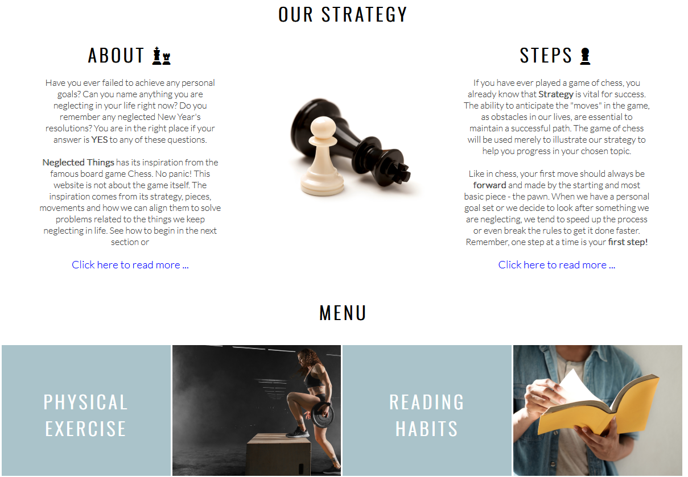

I used [coolors.co](https://coolors.co/e84610-009fe3-4a4a4f-445261-d63649-e6ecf0-000000) to generate my colour palette.

### Typography

Neglected Things website uses Oswald font for their headings and Lato font for secondary text. Sans-serif is used as backup font. 
Social media icons and chess pieces icons were imported from Font Awesome.

Example:

- [Oswald](https://fonts.google.com/specimen/Oswald) was used for the primary headers and titles.

- [Lato](https://fonts.google.com/specimen/Lato) was used for all other secondary text.

- [Font Awesome](https://fontawesome.com) icons were used throughout the site, such as the social media icons in the footer.

## Features

**The header**

The header shows the logo followed by the website's name, NEGLECTED THINGS, presented in black capitals, one of the two 
main colours of the website's palette.
The “Sign In” button is displayed at the same level as the logo to highlight its importance to the subscribed members 
and is in dark grey. The dark grey colour contrasts nicely with the white background; it is easy-on-the-eye when reading and 
is presented in lower-case text.  

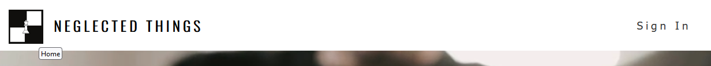

**The Index Page**

The Index Page has a simple design comprising a box calling for action – “Sign Up” (to the website) as well as a “Skip” 
button function which allows users to move directly to the home page.
This landing page is intentionally placed first to gain subscriptions and to allow subscribers to sign in and enjoy 
members-only sections.
The “Sign Up” button switches from black to white when the mouse hovers on the button, following the same design criteria 
adopted by the “Neglected Things” website, referring to the chess board with black and white backgrounds.

**The Footer**

The footer contains four icons imported from [Font Awesome](https://fontawesome.com), they are linked to the Neglected Things'
social media platforms.

[Facebook](https://www.facebook.com/profile.php?id=100089159984840)
[Isntagram](https://www.instagram.com/neglectedthings/)
[YouTube](https://www.youtube.com/channel/UCKFM9pFvSz6eN4ieF5fwVwA)
[Twitter](https://twitter.com/Phil_seiber)

**The Navigation Bar**

The navigation bar is featured on the home page on the top-right of the main image below the header.
Composed of six options, the navigation bar contents are displayed in dark grey. They were intentionally not capitalized 
to provide some balance between Logo text and heading texts, accentuating a harmonic contrast in the page.
When hovering with the mouse over each section, that navigation option becomes highlighted in black, emphasizing the concept 
of a chess board with predominant black and white tiles.
All sections in the navigation bar are internal links leading the user to a specific area on the home page.
"My List" and "Inspire Me" contents are exclusive to subscribed users and, if clicked, lead automatically to the “Sign In/Sign Up” section. 

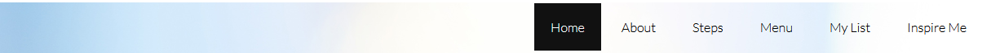

**The “About” Section**

The “About” section on the Home page provides the user with brief details about “Neglected Things” and how the website is structured 
to help people with different ‘neglected’ objectives achieve personal goals in fields such as personal care, reading habits, eating habits 
and others.
There are two paragraphs providing a summary of the main information with a “click to read more” function below this text for those 
users who prefer to learn more about the website before proceeding to a particular feature.  
Utilising the visual thematic of the chess board, the section is highlighted with a chess piece icon, and it is separated from the 
adjacent “Steps” section by a related chess piece image.  

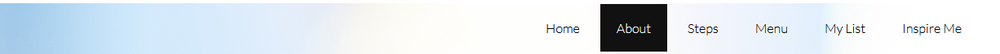

**The “Steps” section**
The “Steps” section is intentionally displayed side-by-side with the “About” section to provide a natural segue from the information 
text to the starting text with the minimum information necessary.
It has a parallel structure to the neighbouring “About” section but has a different, distinguishing chess piece icon, the pawn, which 
is the staring piece in a game of chess. 
A link at the end of the section leads users to the steps page for more information about the methodology followed by Neglected Things.

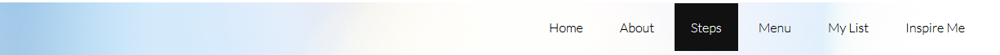

**The “Menu” section**
The menu section is composed of 6 potentially neglected fields of our lives: Physical activities, reading habits, eating habits, feelings, 
personal care, and how to learn.
The design adopted for the Menu again references the chess board dynamic, placing two contrasted boxes side by side. One box with light 
turquoise background colour hosts the text, and the other box hosts a corresponding image. The paired boxes link the users to the related page 
and subject.
The light turquoise background colour was intentionally selected for the first text box to soften the section's colour balance and to follow 
the design structure.
For this project only the first field - Physical activity, is linked to a page as an example.

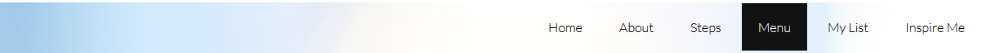

**The “My List” and “Inspire Me” sections**

These options are both linked to the “Sign In/Sign Up” section at the bottom of the home page. These two options are not populated for this 
project but are connected to the aforementioned section showing that a sign-in is required to access.
In the future, I intend to develop exclusive features for members only, providing a space to record individual choice of subjects, paths and 
the number of weeks covered.
The “Inspire Me” option will be developed to display motivational videos of users who achieved their goals by using the platform, sharing 
their testimonials and reviews. 

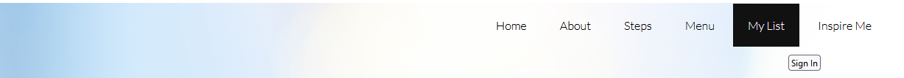
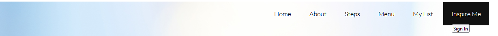

**The “Sign In/Sign Up” section**
Placed in the last part of the body of the home page the “Sign In/Sign Up” section calls users one more time to sign up or sign in to enjoy 
exclusive content and personalized functionality - like a personal list of subjects chosen across the website.

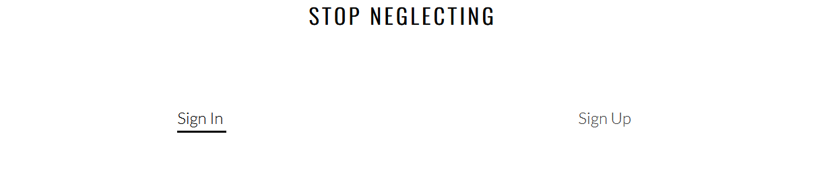
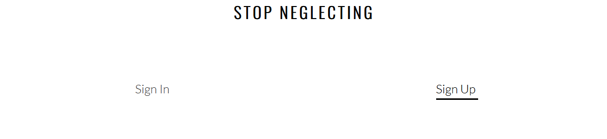

**The “Sign Up” page**
The “Sign Up” page can be accessed from all main pages of the website. The subscription of new members is one of the main targets of the 
site owner, along with video views.

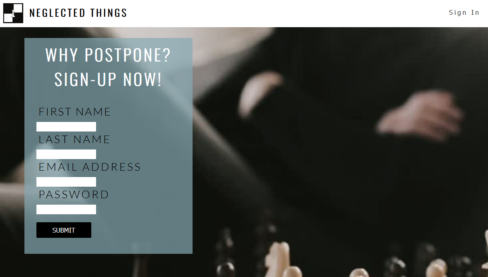

**The “Sign In” page**
The Sign-in page is temporarily displayed in the form of an external page due to the limited time available to submit the project. In the 
future, activating the “sign in” function will result in the appearance of an additional drop-bar at the top of the home page under the “sign in” 
link, with fields for login credentials thus avoiding the need for an external page.

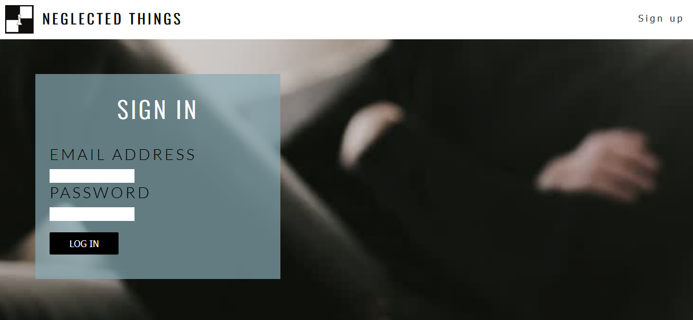

### Existing Features

- **Social Media Integration**

    - Even being considered an old feature, the social media integration is present at Neglected things site with their respective icons linked 
    in the footer. This integration has a vital role for us once social media will be used as diffusor of knowledge to the users and the 
    opportunity of sharing their experiences in the platform.

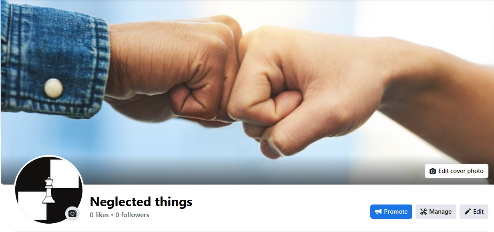

- **Feature #2**

    - Details about this particular feature, including the value to the site, and benefit for the user. Be as detailed as possible!

- **Feature #3**

    - Details about this particular feature, including the value to the site, and benefit for the user. Be as detailed as possible!

⚠️⚠️⚠️⚠️⚠️ START OF NOTES (to be deleted) ⚠️⚠️⚠️⚠️⚠️

Repeat as necessary for as many features as your site contains.

Hint: the more, the merrier!

🛑🛑🛑🛑🛑 END OF NOTES (to be deleted) 🛑🛑🛑🛑🛑

### Future Features

⚠️⚠️⚠️⚠️⚠️ START OF NOTES (to be deleted) ⚠️⚠️⚠️⚠️⚠️

Do you have additional ideas that you'd like to include on your project in the future?
Fantastic! List them here!
It's always great to have plans for future improvements!
Consider adding any helpful links or notes to help remind you in the future, if you revisit the project in a couple years.

🛑🛑🛑🛑🛑 END OF NOTES (to be deleted) 🛑🛑🛑🛑🛑

- Cool new feature #1
    - Any additional notes about this feature.
- Cool new feature #2
    - Any additional notes about this feature.
- Cool new feature #3
    - Any additional notes about this feature.

## Tools & Technologies Used

⚠️⚠️⚠️⚠️⚠️ START OF NOTES (to be deleted) ⚠️⚠️⚠️⚠️⚠️

In this section, you should explain the various tools and technologies used to develop the project.
Make sure to put a link (where applicable) to the source, and explain what each was used for.
Some examples have been provided, but this is just a sample only, your project might've used others.
Feel free to delete any unused items below as necessary.

🛑🛑🛑🛑🛑 END OF NOTES (to be deleted) 🛑🛑🛑🛑🛑

- [HTML](https://en.wikipedia.org/wiki/HTML) used for the main site content.
- [CSS](https://en.wikipedia.org/wiki/CSS) used for the main site design and layout.
- [CSS :root variables](https://www.w3schools.com/css/css3_variables.asp) used for reusable styles throughout the site.
- [CSS Flexbox](https://www.w3schools.com/css/css3_flexbox.asp) and/or [CSS Grid](https://www.w3schools.com/css/css_grid.asp) used for an enhanced responsive layout.
- [Bootstrap](https://getbootstrap.com) used as the front-end CSS framework for modern responsiveness and pre-built components.
- [Materialize](https://materializecss.com) used as the front-end CSS framework for modern responsiveness and pre-built components.
- [JavaScript](https://www.javascript.com) used for user interaction on the site.
- [Python](https://www.python.org) used as the back-end programming language.
- [Git](https://git-scm.com) used for version control. (`git add`, `git commit`, `git push`)
- [GitHub](https://github.com) used for secure online code storage.
- [GitHub Pages](https://pages.github.com) used for hosting the deployed front-end site.
- [Gitpod](https://gitpod.io) used as a cloud-based IDE for development.
- [Markdown Builder by Tim Nelson](https://traveltimn.github.io/markdown-builder) used to help generate the Markdown files.
- [Flask](https://flask.palletsprojects.com) used as the Python framework for the site.
- [Django](https://www.djangoproject.com) used as the Python framework for the site.
- [MongoDB](https://www.mongodb.com) used as the non-relational database management with Flask.
- [SQLAlchemy](https://www.sqlalchemy.org) used as the relational database management with Flask.
- [PostgreSQL](https://www.postgresql.org) used as the relational database management.
- [ElephantSQL](https://www.elephantsql.com) used as the Postgres database.
- [Heroku](https://www.heroku.com) used for hosting the deployed back-end site.
- [Cloudinary](https://cloudinary.com) used for online static file storage.
- [Stripe](https://stripe.com) used for online secure payments of ecommerce products/services.
- [AWS S3](https://aws.amazon.com/s3) used for online static file storage.

## Testing

For all testing, please refer to the [TESTING.md](TESTING.md) file.

## Deployment

The site was deployed to GitHub Pages. The steps to deploy are as follows:
- In the [GitHub repository](https://github.com/FelipeSeiberlich/neglected-things), navigate to the Settings tab 
- From the source section drop-down menu, select the **Main** Branch, then click "Save".
- The page will be automatically refreshed with a detailed ribbon display to indicate the successful deployment.

The live link can be found [here](https://felipeseiberlich.github.io/neglected-things)

### Local Deployment

This project can be cloned or forked in order to make a local copy on your own system.

#### Cloning

You can clone the repository by following these steps:

1. Go to the [GitHub repository](https://github.com/FelipeSeiberlich/neglected-things) 
2. Locate the Code button above the list of files and click it 
3. Select if you prefer to clone using HTTPS, SSH, or GitHub CLI and click the copy button to copy the URL to your clipboard
4. Open Git Bash or Terminal
5. Change the current working directory to the one where you want the cloned directory
6. In your IDE Terminal, type the following command to clone my repository:
	- `git clone https://github.com/FelipeSeiberlich/neglected-things.git`
7. Press Enter to create your local clone.

Alternatively, if using Gitpod, you can click below to create your own workspace using this repository.

Please note that in order to directly open the project in Gitpod, you need to have the browser extension installed.
A tutorial on how to do that can be found [here](https://www.gitpod.io/docs/configure/user-settings/browser-extension).

#### Forking

By forking the GitHub Repository, we make a copy of the original repository on our GitHub account to view and/or make changes without affecting the original owner's repository.
You can fork this repository by using the following steps:

1. Log in to GitHub and locate the [GitHub Repository](https://github.com/FelipeSeiberlich/neglected-things)
2. At the top of the Repository (not top of page) just above the "Settings" Button on the menu, locate the "Fork" Button.
3. Once clicked, you should now have a copy of the original repository in your own GitHub account!

### Local VS Deployment

⚠️⚠️⚠️⚠️⚠️ START OF NOTES (to be deleted) ⚠️⚠️⚠️⚠️⚠️

Use this space to discuss any differences between the local version you've developed, and the live deployment site on GitHub Pages.

🛑🛑🛑🛑🛑 END OF NOTES (to be deleted) 🛑🛑🛑🛑🛑

## Credits

⚠️⚠️⚠️⚠️⚠️ START OF NOTES (to be deleted) ⚠️⚠️⚠️⚠️⚠️

In this section you need to reference where you got your content, media, and extra help from.
It is common practice to use code from other repositories and tutorials,
however, it is important to be very specific about these sources to avoid plagiarism.

🛑🛑🛑🛑🛑 END OF NOTES (to be deleted) 🛑🛑🛑🛑🛑

### Content

⚠️⚠️⚠️⚠️⚠️ START OF NOTES (to be deleted) ⚠️⚠️⚠️⚠️⚠️

Use this space to provide attribution links to any borrowed code snippets, elements, or resources.
A few examples have been provided below to give you some ideas.

Ideally, you should provide an actual link to every resource used, not just a generic link to the main site!

🛑🛑🛑🛑🛑 END OF NOTES (to be deleted) 🛑🛑🛑🛑🛑

| Source | Location | Notes |
| --- | --- | --- |
| [Markdown Builder by Tim Nelson](https://traveltimn.github.io/markdown-builder) | README and TESTING | tool to help generate the Markdown files |
| [Chris Beams](https://chris.beams.io/posts/git-commit) | version control | "How to Write a Git Commit Message" |
| [W3Schools](https://www.w3schools.com/howto/howto_js_topnav_responsive.asp) | entire site | responsive HTML/CSS/JS navbar |
| [W3Schools](https://www.w3schools.com/howto/howto_css_modals.asp) | contact page | interactive pop-up (modal) |
| [W3Schools](https://www.w3schools.com/css/css3_variables.asp) | entire site | how to use CSS :root variables |
| [Flexbox Froggy](https://flexboxfroggy.com/) | entire site | modern responsive layouts |
| [Grid Garden](https://cssgridgarden.com) | entire site | modern responsive layouts |
| [StackOverflow](https://stackoverflow.com/a/2450976) | quiz page | Fisher-Yates/Knuth shuffle in JS |
| [YouTube](https://www.youtube.com/watch?v=YL1F4dCUlLc) | leaderboard | using `localStorage()` in JS for high scores |
| [YouTube](https://www.youtube.com/watch?v=u51Zjlnui4Y) | PP3 terminal | tutorial for adding color to the Python terminal |
| [strftime](https://strftime.org) | CRUD functionality | helpful tool to format date/time from string |
| [WhiteNoise](http://whitenoise.evans.io) | entire site | hosting static files on Heroku temporarily |

### Media

⚠️⚠️⚠️⚠️⚠️ START OF NOTES (to be deleted) ⚠️⚠️⚠️⚠️⚠️

Use this space to provide attribution links to any images, videos, or audio files borrowed from online.
A few examples have been provided below to give you some ideas.

If you're the owner (or a close acquaintance) of all media files, then make sure to specify this.
Let the assessors know that you have explicit rights to use the media files within your project.

Ideally, you should provide an actual link to every media file used, not just a generic link to the main site!
The list below is by no means exhaustive. Within the Code Institute Slack community, you can find more "free media" links
by sending yourself the following command: `!freemedia`.

🛑🛑🛑🛑🛑 END OF NOTES (to be deleted) 🛑🛑🛑🛑🛑

| Source | Location | Type | Notes |
| --- | --- | --- | --- |
| [Pexels](https://www.pexels.com) | entire site | image | favicon on all pages |
| [Lorem Picsum](https://picsum.photos) | home page | image | hero image background |
| [Unsplash](https://unsplash.com) | product page | image | sample of fake products |
| [Pixabay](https://pixabay.com) | gallery page | image | group of photos for gallery |
| [Wallhere](https://wallhere.com) | footer | image | background wallpaper image in the footer |
| [This Person Does Not Exist](https://thispersondoesnotexist.com) | testimonials | image | headshots of fake testimonial images |
| [Audio Micro](https://www.audiomicro.com/free-sound-effects) | game page | audio | free audio files to generate the game sounds |
| [Videvo](https://www.videvo.net/) | home page | video | background video on the hero section |
| [TinyPNG](https://tinypng.com) | entire site | image | tool for image compression |

### Acknowledgements

⚠️⚠️⚠️⚠️⚠️ START OF NOTES (to be deleted) ⚠️⚠️⚠️⚠️⚠️

Use this space to provide attribution to any supports that helped, encouraged, or supported you throughout the development stages of this project.
A few examples have been provided below to give you some ideas.

🛑🛑🛑🛑🛑 END OF NOTES (to be deleted) 🛑🛑🛑🛑🛑

- I would like to thank my Code Institute mentor, [John/Jane Doe](https://github.com/username) for their support throughout the development of this project.
- I would like to thank the [Code Institute](https://codeinstitute.net) tutor team for their assistance with troubleshooting and debugging some project issues.
- I would like to thank the [Code Institute Slack community](https://code-institute-room.slack.com) for the moral support; it kept me going during periods of self doubt and imposter syndrome.
- I would like to thank my spouse/partner (John/Jane), for believing in me, and allowing me to make this transition into software development.
- I would like to thank my employer, for supporting me in my career development change towards becoming a software developer.