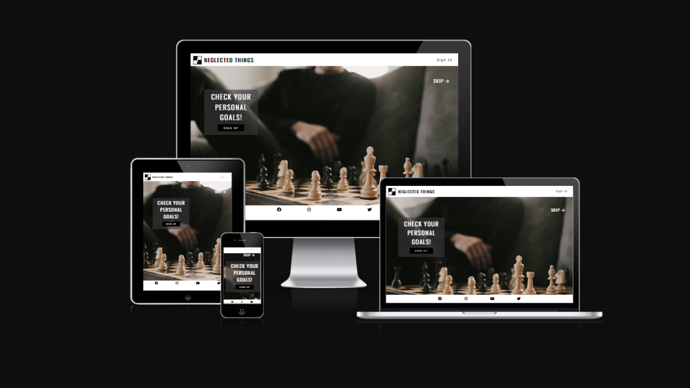

# NEGLECTED THINGS

“Neglected Things” is a website directed at those who wish to improve their management and strategy skills when dealing with daily tasks, personal goals,
procrastination, or neglected areas of their lives.  The menu of the website displays different aspects of users lives to help them incorporate these 
“Neglected Things” into their daily routine.

Users of this website will be able to understand the importance of doing things progressively - starting from basic to the more advanced situations,
setting realistic goals, and respecting a timeframe.  To provide background inspiration these are set around chess-inspired concepts and strategy. 

Consider adding a mockup image using the "Am I Responsive" website.

Deployed site link: [NEGLECTED THINGS](https://felipeseiberlich.github.io/neglected-things)

## CREATOR

Felipe Seiberlich

Code Institute student, 2023.

## UX

Neglected Things’ design is inspired by the game of chess. Following the variety of movement of the pieces around 
the board, I designed this website to be easily navigable across the page’s levels and from top to bottom.
The landing page has a chess theme video of a man moving a piece. This video was selected to demonstrate that an 
action or a move is necessary to achieve personal goals or to incorporate these neglected things into their daily 
routine.
The box displayed on top of the video has one of the extra colours selected but the text and button calling for 
action have the chess reference. This reference can also be seeing in the Logo, Navigation Bar when mouse hovers 
on it and in the Menu that displays like a chess board. (Only for desktops, laptops and tablets) 

### Colour Scheme

In the early stages of the project, I envisioned a monochromatic site, playing with black and white backgrounds 
and text. My inspiration for Neglected Things was based on the visuals of the chess board game, piece movements 
and its tactics and strategies. The website is not about chess itself, so I decided to add extra colours to the 
website’s palette, so users could distinguish the actual concept of the site while experiencing the chess game 
as a complementary backdrop.

- `#000000` used for primary text.
- `#ffffff` used for primary highlights.
- `#3a3a3a` used for body and secondary text.
- `#86a9b4` used for boxes background.
- `#0000ff` used for text links.

[Colour scheme](https://coolors.co/000000-ffffff-3a3a3a-86a9b4-0000ff)

Example:

I used [coolors.co](https://coolors.co/e84610-009fe3-4a4a4f-445261-d63649-e6ecf0-000000) to generate my colour palette.

### Typography

The font-family selected for Neglected Things body is Lato, sans-serif and for the Headings Oswad, sans-serif a typographic 
style that is appealing and clear. 

Example:

- [Oswald](https://fonts.google.com/specimen/Oswald) was used for the primary headers and titles.

- [Lato](https://fonts.google.com/specimen/Lato) was used for all other secondary text.

- [Font Awesome](https://fontawesome.com) icons were used throughout the site, such as the social media icons in the footer.

## Features

**The header**

The header shows the logo followed by the website's name, NEGLECTED THINGS, presented in black capitals, one of the two 
main colours of the website's palette.
The “Sign In” button is displayed at the same level as the logo to highlight its importance to the subscribed members 
and is in dark grey. The dark grey colour contrasts nicely with the white background; it is easy-on-the-eye when reading and 
is presented in lower-case text.  

**The Index Page**

The Index Page has a simple design comprising a box calling for action – “Sign Up” (to the website) as well as a “Skip” 
button function which allows users to move directly to the home page.
This landing page is intentionally placed first to gain subscriptions and to allow subscribers to sign in and enjoy 
members-only sections.
The “Sign Up” button switches from black to white when the mouse hovers on the button, following the same design criteria 
adopted by the “Neglected Things” website, referring to the chess board with black and white backgrounds.

**The Footer**

The footer contains four icons imported from [Font Awesome](https://fontawesome.com), they are linked to the Neglected Things'
social media platforms.

[Facebook](https://www.facebook.com/profile.php?id=100089159984840)
[Isntagram](https://www.instagram.com/neglectedthings/)
[YouTube](https://www.youtube.com/channel/UCKFM9pFvSz6eN4ieF5fwVwA)
[Twitter](https://twitter.com/Phil_seiber)

**The Navigation Bar**

The navigation bar is featured on the home page on the top-right of the main image below the header.
Composed of six options, the navigation bar contents are displayed in dark grey. They were intentionally not capitalized 
to provide some balance between Logo text and heading texts, accentuating a harmonic contrast in the page.
When hovering with the mouse over each section, that navigation option becomes highlighted in black, emphasizing the concept 
of a chess board with predominant black and white tiles.
All sections in the navigation bar are internal links leading the user to a specific area on the home page.
"My List" and "Inspire Me" contents are exclusive to subscribed users and, if clicked, lead automatically to the “Sign In/Sign Up” section. 

**The “About” Section**

The “About” section on the Home page provides the user with brief details about “Neglected Things” and how the website is structured 
to help people with different ‘neglected’ objectives achieve personal goals in fields such as personal care, reading habits, eating habits 
and others.
There are two paragraphs providing a summary of the main information with a “click to read more” function below this text for those 
users who prefer to learn more about the website before proceeding to a particular feature.  
Utilising the visual thematic of the chess board, the section is highlighted with a chess piece icon, and it is separated from the 
adjacent “Steps” section by a related chess piece image.  

**The “Steps” section**
The “Steps” section is intentionally displayed side-by-side with the “About” section to provide a natural segue from the information 
text to the starting text with the minimum information necessary.
It has a parallel structure to the neighbouring “About” section but has a different, distinguishing chess piece icon, the pawn, which 
is the staring piece in a game of chess. 
A link at the end of the section leads users to the steps page for more information about the methodology followed by Neglected Things.

**The “Menu” section**
The menu section is composed of 6 potentially neglected fields of our lives: Physical activities, reading habits, eating habits, feelings, 
personal care, and how to learn.
The design adopted for the Menu again references the chess board dynamic, placing two contrasted boxes side by side. One box with light 
turquoise background colour hosts the text, and the other box hosts a corresponding image. The paired boxes link the users to the related page 
and subject.
The light turquoise background colour was intentionally selected for the first text box to soften the section's colour balance and to follow 
the design structure.
For this project only the first field - Physical activity, is linked to a page as an example.

**The “My List” and “Inspire Me” sections**

These options are both linked to the “Sign In/Sign Up” section at the bottom of the home page. These two options are not populated for this 
project but are connected to the aforementioned section showing that a sign-in is required to access.
In the future, I intend to develop exclusive features for members only, providing a space to record individual choice of subjects, paths and 
the number of weeks covered.
The “Inspire Me” option will be developed to display motivational videos of users who achieved their goals by using the platform, sharing 
their testimonials and reviews. 

**The “Sign In/Sign Up” section**
Placed in the last part of the body of the home page the “Sign In/Sign Up” section calls users one more time to sign up or sign in to enjoy 
exclusive content and personalized functionality - like a personal list of subjects chosen across the website.

**The “Sign Up” page**
The “Sign Up” page can be accessed from all main pages of the website. The subscription of new members is one of the main targets of the 
site owner, along with video views.

**The “Sign In” page**
The Sign-in page is temporarily displayed in the form of an external page due to the limited time available to submit the project. In the 
future, activating the “sign in” function will result in the appearance of an additional drop-bar at the top of the home page under the “sign in” 
link, with fields for login credentials thus avoiding the need for an external page.

### Existing Features

- **Social Media Integration**

    - While being considered an older feature, a social media integration footer is present on the main pages of the Neglected Things site 
    using the respective linked icons. This integration has a vital role as use of social media will be encouraged to share knowledge among 
    the users with the opportunity of sharing experiences.

- **Animation using transition**

    - A CSS animation feature was added to all Sign In and Sign Up elements in the website, making a smooth change in the visuals properties.
    Without the transition feature, transform would abruptly manipulate from one state to another. This smooth transition of the animation
    provides a pleasant experience to the users.

- **Images scales up**

    - The images displayed in the Menu scales up when the mouse hovers on top of them. This features provides a nice experience to the users
    and gives the website a modern appearence.

### Future Features

In the future I would like to implement flex boxes in the second section of the Home page and a dropdown Navigation bar with subscribed members' contents.

- Scroll snap #1
    - I would like to add a scroll snap for the Menu with the mobile resolution.
- Flex boxes #2
    - I would like to replace the floating elements in the second section of the Home page for flex boxes.
- Accent-color #3
    - I would like to use this new feature with the checkboxes of the contents covered by the users.

## Tools & Technologies Used

I have listed bellow all tools and tecnologies used to develop Neglected Things Website.

- [HTML](https://en.wikipedia.org/wiki/HTML) used for the main site content.
- [CSS](https://en.wikipedia.org/wiki/CSS) used for the main site design and layout.
- [Git](https://git-scm.com) used for version control. (`git add`, `git commit`, `git push`)
- [GitHub](https://github.com) used for secure online code storage.
- [GitHub Pages](https://pages.github.com) used for hosting the deployed front-end site.
- [Gitpod](https://gitpod.io) used as a cloud-based IDE for development.
- [Markdown Builder by Tim Nelson](https://traveltimn.github.io/markdown-builder) used to help generate the Markdown files.

## Testing

For all testing, please refer to the [TESTING.md](TESTING.md) file.

## Deployment

The site was deployed to GitHub Pages. The steps to deploy are as follows:
- In the [GitHub repository](https://github.com/FelipeSeiberlich/neglected-things), navigate to the Settings tab 
- From the source section drop-down menu, select the **Main** Branch, then click "Save".
- The page will be automatically refreshed with a detailed ribbon display to indicate the successful deployment.

The live link can be found [here](https://felipeseiberlich.github.io/neglected-things)

### Local Deployment

This project can be cloned or forked in order to make a local copy on your own system.

#### Cloning

You can clone the repository by following these steps:

1. Go to the [GitHub repository](https://github.com/FelipeSeiberlich/neglected-things) 
2. Locate the Code button above the list of files and click it 
3. Select if you prefer to clone using HTTPS, SSH, or GitHub CLI and click the copy button to copy the URL to your clipboard
4. Open Git Bash or Terminal
5. Change the current working directory to the one where you want the cloned directory
6. In your IDE Terminal, type the following command to clone my repository:
	- `git clone https://github.com/FelipeSeiberlich/neglected-things.git`
7. Press Enter to create your local clone.

Alternatively, if using Gitpod, you can click below to create your own workspace using this repository.

Please note that in order to directly open the project in Gitpod, you need to have the browser extension installed.
A tutorial on how to do that can be found [here](https://www.gitpod.io/docs/configure/user-settings/browser-extension).

#### Forking

By forking the GitHub Repository, we make a copy of the original repository on our GitHub account to view and/or make changes without affecting the original owner's repository.
You can fork this repository by using the following steps:

1. Log in to GitHub and locate the [GitHub Repository](https://github.com/FelipeSeiberlich/neglected-things)
2. At the top of the Repository (not top of page) just above the "Settings" Button on the menu, locate the "Fork" Button.
3. Once clicked, you should now have a copy of the original repository in your own GitHub account!

### Local VS Deployment

⚠️⚠️⚠️⚠️⚠️ START OF NOTES (to be deleted) ⚠️⚠️⚠️⚠️⚠️

Use this space to discuss any differences between the local version you've developed, and the live deployment site on GitHub Pages.

🛑🛑🛑🛑🛑 END OF NOTES (to be deleted) 🛑🛑🛑🛑🛑

## Credits

I would like to credit [Canva](https://www.canva.com/)for all imaginary and video used on [NEGLECTED THINGS](https://felipeseiberlich.github.io/neglected-things)
website. I also would like to credit [W3Schools](https://www.w3schools.com/) and [Kevin Powell YouTube channel](https://www.youtube.com/) for helping me with the development of Neglected Things' Nav bar and animations using the transition element.
In relation to the README.md file, I would like to credit [Tim Nelson](https://github.com/TravelTimN) for developing this amazing tool [Markdown Builder by Tim Nelson](https://traveltimn.github.io/markdown-builder) used to help generate the Markdown files. This generator provides guidance to the students to build a well structured
documentation.

### Content

| [Markdown Builder by Tim Nelson](https://traveltimn.github.io/markdown-builder) | README and TESTING | tool to help generate the Markdown files |
| [Kevin Powell YouTube channel](https://www.youtube.com/watch?v=8QKOaTYvYUA) | Responsive Nav Bar | "Create a responsive navigation nav with no JS!" |
| [W3Schools](https://www.w3schools.com/css/css_navbar.asp) | Navigation bar | responsive HTML/CSS navbar |
| [Code Institute](https://learn.codeinstitute.net) | About/Steps section | how to use float |
| [Code Institute](https://learn.codeinstitute.net) | Forms | how to create forms |
    
### Media

Find bellow a list of attribution links to all images and videos files borrowed from online.

| [Favico.ico](https://www.favicon.cc/) | entire site | image | favicon on all pages |
| [Canva](https://www.canva.com/) | entire site | image and video | Video in the Index page and imaginary in the home page |
| [Font Awesome](https://fontawesome.com) | Footer and About/Steps sections | Icon | Icons of chess pieces |

### Acknowledgements

- I would like to thank my Code Institute mentor, [Tim Nelson](https://github.com/TravelTimN) for their support throughout the development of this project.
- I would like to thank the [Code Institute](https://codeinstitute.net) tutor team for their assistance with troubleshooting and debugging some project issues.
- I would like to thank the [Code Institute Slack community](https://code-institute-room.slack.com) for the moral support.
- I would like to thank my best friend (Nailla Santos), for believing in me, and allowing me to make this transition into software development.
