# Testing

Return back to the [README.md](README.md) file.

[NEGLECTED THINGS'](https://felipeseiberlich.github.io/neglected-things/) website was methodicaly and consistenly tested and re-tested 
to assure the best user experience. Code validation, browser compatibility, responsiveness, lighthouse audit and Git hub issues ('bugs') 
were included in this testing process to comply with W3C standards. 

## Code Validation

I decided to validate [NEGLECTED THINGS'](https://felipeseiberlich.github.io/neglected-things/) local code and the live site pages as
shown bellow.

### HTML

I have used the recommended [HTML W3C Validator](https://validator.w3.org) to validate all of my HTML files.

### Local file by input

#### index.html file
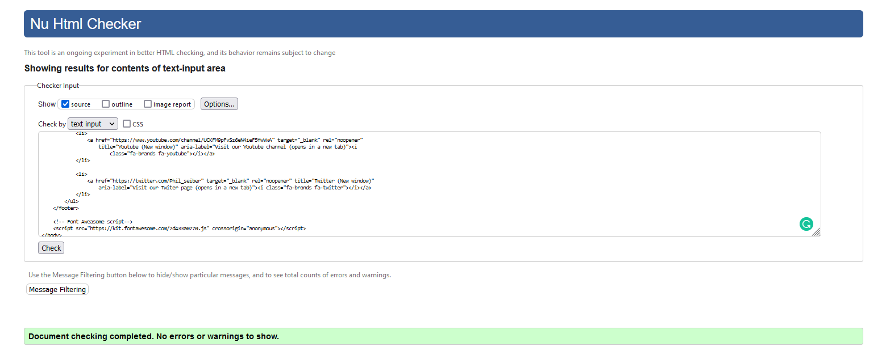

#### home.html file
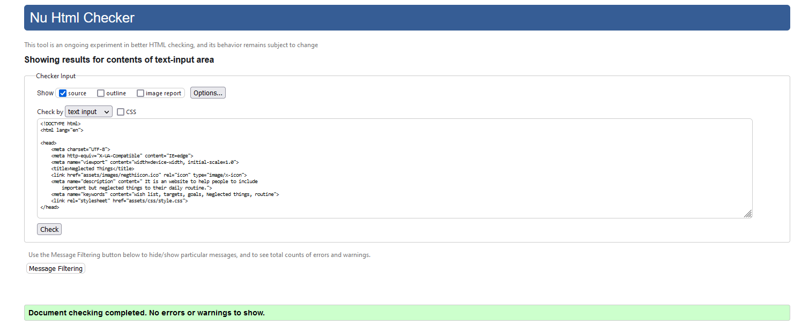

#### signin.html file
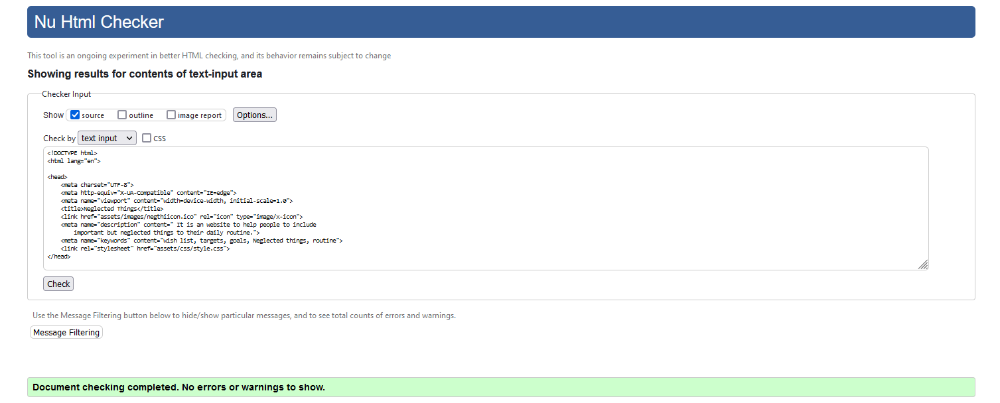

#### signup.html file
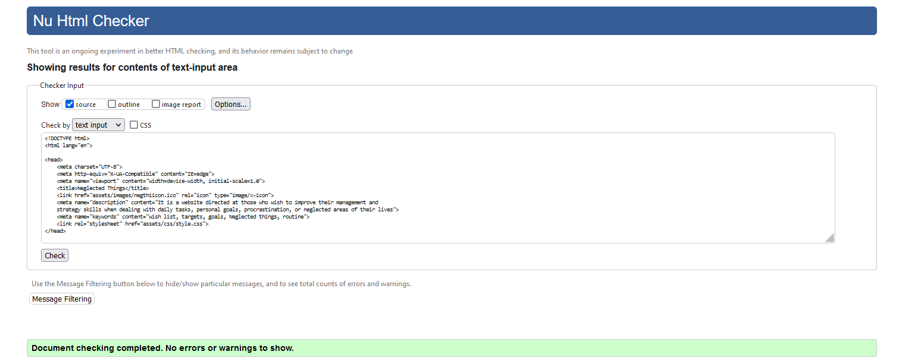

### Live deployed site pages

All HTML pages were validated as shown bellow.

| Page | W3C URL | Screenshot | Notes |
| --- | --- | --- | --- |
| Landing | [W3C](https://validator.w3.org/nu/?doc=https%3A%2F%2Ffelipeseiberlich.github.io%2Fneglected-things%2F) | 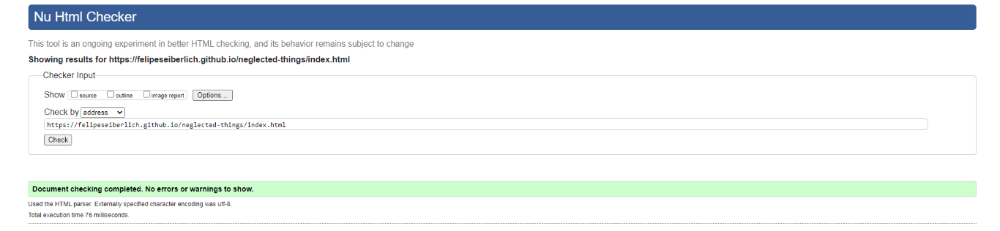| Pass: No Errors |
| Home | [W3C](https://validator.w3.org/nu/?doc=https%3A%2F%2Ffelipeseiberlich.github.io%2Fneglected-things%2Fhome.html) | 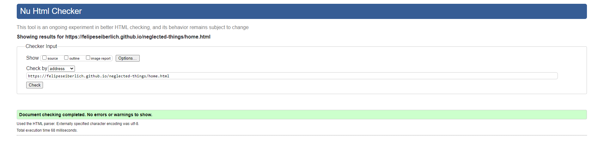 | Pass: No Errors |
| Sign In | [W3C](https://validator.w3.org/nu/?doc=https%3A%2F%2Ffelipeseiberlich.github.io%2Fneglected-things%2Fsign-in.html) | 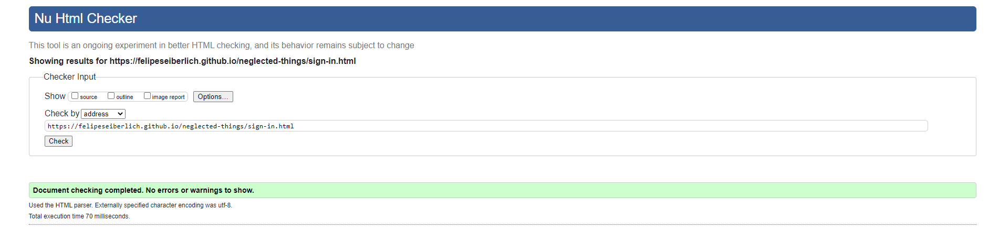 | Pass: No Errors |
| Sign Up | [W3C](https://validator.w3.org/nu/?doc=https%3A%2F%2Ffelipeseiberlich.github.io%2Fneglected-things%2Fsign-up.html) | 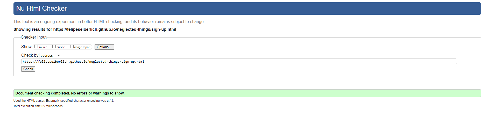 | Pass: No Errors |

### CSS

I have used the recommended [CSS Jigsaw Validator](https://jigsaw.w3.org/css-validator) to validate all of my CSS files.

[NEGLECTED THINGS'](https://felipeseiberlich.github.io/neglected-things/) was validated using local code and the live site pages as
shown bellow.

### Local CSS file by input

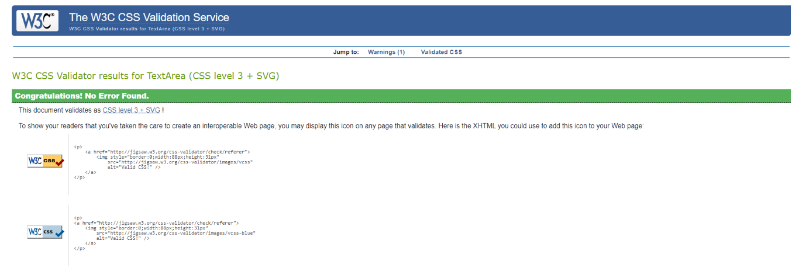

### Live deployed site

| File | Jigsaw URL | Screenshot | Notes |
| --- | --- | --- | --- |
| style.css | [Jigsaw](https://jigsaw.w3.org/css-validator/validator?uri=+https%3A%2F%2Ffelipeseiberlich.github.io%2Fneglected-things%2F&profile=css3svg&usermedium=all&warning=1&vextwarning=&lang=en) | 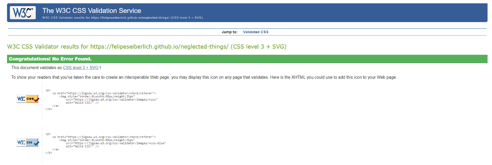 | Pass: No Errors |

## Browser Compatibility

[Chrome](https://www.google.com/chrome), [Firefox (Developer Edition)](https://www.mozilla.org/firefox/developer) and [Edge](https://www.microsoft.com/edge)
were selected to check [NEGLECTED THINGS'](https://felipeseiberlich.github.io/neglected-things/) browser compatibility.

I've tested my deployed project on multiple browsers to check for compatibility issues.
- [Chrome](https://www.google.com/chrome) presented minor CSS differences in the social media icons size as at Homes' first section image viewport display.
- [Firefox (Developer Edition)](https://www.mozilla.org/firefox/developer) works as expected.
- [Edge](https://www.microsoft.com/edge) presented minor CSS differences in the social media icons size as at Homes' first section image viewport display.
- [Safari](https://www.apple.com/safari/) presented some CSS differences on the background video (Index page), where a play button is displayed, and on the
sign-in page where the login button is rounded.

Please, refer to screenshots provided for further clarification.

| Browser | Screenshot | Notes |
| --- | --- | --- |
| Chrome | 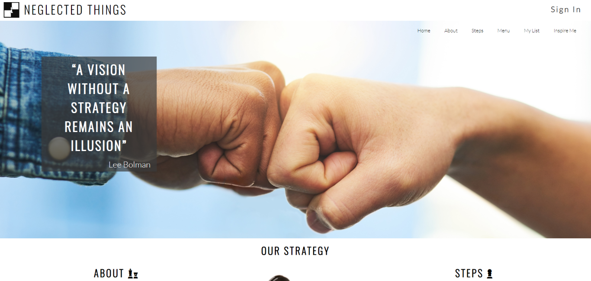 | Minor CSS differences |
| Firefox |  | Works as expected |
| Edge | 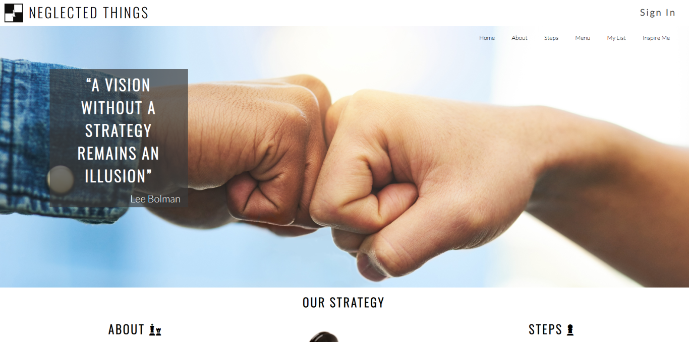 | Minor CSS differences |
| Safari |  | Minor CSS differences |
| Safari |  | CSS differences - play button displayed |
| Safari |  | CSS differences - round button |

## Responsiveness

[NEGLECTED THINGS'](https://felipeseiberlich.github.io/neglected-things/) live/deployed site was meticulously tested for the following device types:
- Mobile
- Tablet
- Desktop
- XL Monitor

I've tested my deployed project on the aforementioned devices to check for responsiveness issues.

| Device | Screenshot | Notes |
| --- | --- | --- |
| Mobile (DevTools) |  | Works as expected |
| Tablet (DevTools) |  | Works as expected |
| Desktop |  | Works as expected |
| XL Monitor |  | Some scaling has minor issues |

## Lighthouse Audit

All [NEGLECTED THINGS'](https://felipeseiberlich.github.io/neglected-things/) pages were tested for mobile and desktop versions.
I've tested my deployed project using the Lighthouse Audit tool to check for any major issues.

| Page | Size | Screenshot | Notes |
| --- | --- | --- | --- |
| Landing | Mobile | 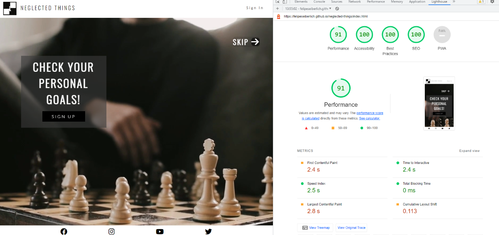 | Few warnings |
| landing | Desktop | 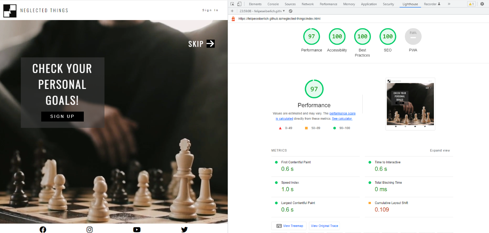 | Some minor warnings |
| Home | Mobile | 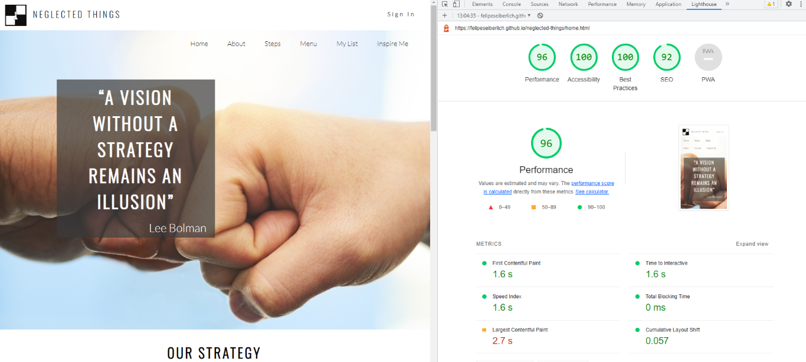 | Some minor warnings |
| Home | Desktop | 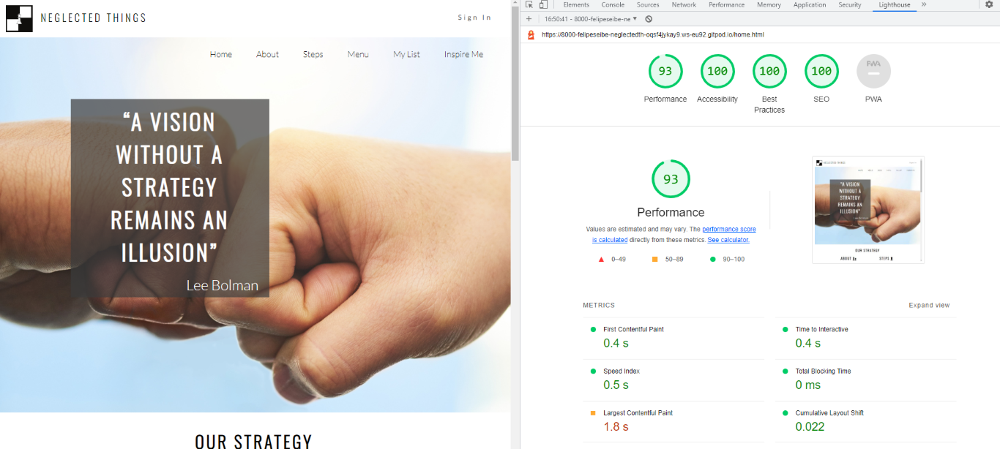 | Some minor warnings |
| Sign In | Mobile | 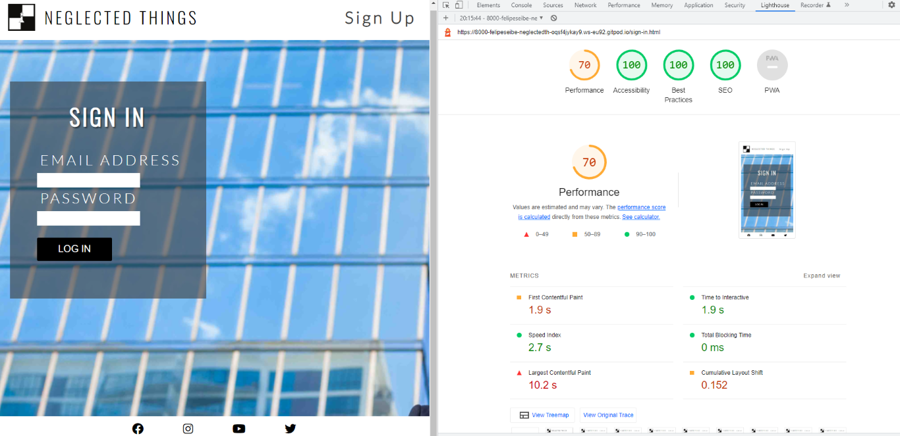 | Few warnings |
| Sign in | Desktop | 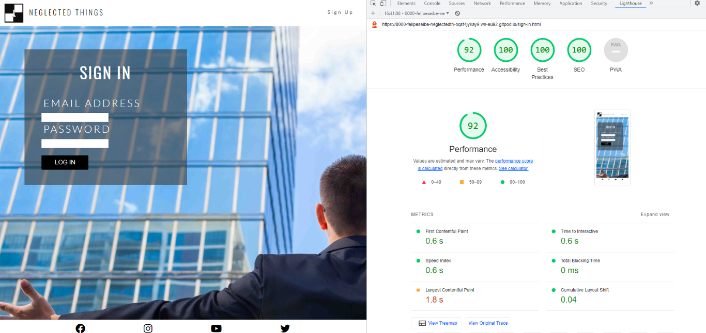 | Some minor warnings  | 
| Sign Up | Mobile |  | Slow response time due to large images |
| Sign Up | Desktop | 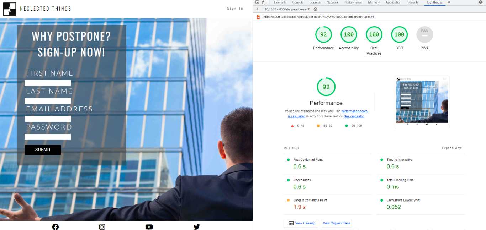 | Some minor warnings |

## Bugs

There are no remaining bugs that I am aware of.

